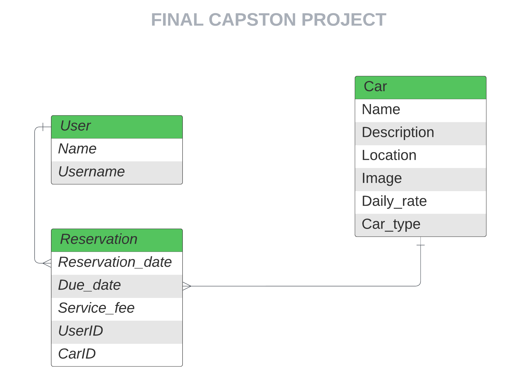

# Full Stack Capstone Backend<a name="readme-top"></a>

<!-- TABLE OF CONTENTS -->

# 📗 Table of Contents

- [Full Stack Capstone Backend](#tdd-project)
- [📗 Table of Contents](#-table-of-contents)
- [📖 TDD-Project ](#-tdd-project-)
  - [🛠 Built With ](#-built-with-)
    - [Tech Stack ](#tech-stack-)
    - [Key Features ](#key-features-)
  - [💻 Getting Started ](#-getting-started-)
    - [Prerequisites](#prerequisites)
    - [Setup](#setup)
    - [Run tests](#run-tests)
    - [Run console](#run-console)
  - [👥 Authors ](#-authors-)
  - [🔭 Future Features ](#-future-features-)
  - [🤝 Contributing ](#-contributing-)
  - [⭐️ Show your support ](#️-show-your-support-)
  - [🙏 Acknowledgments ](#-acknowledgments-)
  - [📝 License ](#-license-)

<!-- PROJECT DESCRIPTION -->

# 📖 Final Capstone <a name="about-project"></a>

**Full Stack Capstone Backend** Explore the backend of Car Reservation App! This repository, powered by Rails, manages user authentication, reservation logic, and API endpoints.

## 🛠 Built With <a name="built-with"></a>

### Tech Stack <a name="tech-stack"></a>

<details>
  <summary>Client</summary>
  <ul>
   <li>Rails</li>
  </ul>
</details>

### Key Features <a name="key-features"><a>

- [Greeting-page]

## Link to the Frontend Repo

- [Frontend](https://github.com/PabloEGonz/full-stack-capstone-front-end)

## ERD


<!-- Getting Started -->

## 💻 Getting Started <a name="getting-started"></a>

To run the project locally, follow these steps.

### Prerequisites

In order to run this project you need to:

- Install [Git](https://git-scm.com/)
- Install [Ruby](https://www.ruby-lang.org/en/)
- Install a code editor, I suggest [VsCode](https://code.visualstudio.com/)

### Setup

Clone the repo into your local machine:

```bash
git clone https://github.com/ezraermy/Full-Stack-Capstone-Backend.git
```

Install the dependencies using npm:

```bash
bundler install
```

Do this to for database migrations :

```bash
rails db:drop
```

```bash
rails db:create
```

```bash
rails db:migrate
```

### Run tests

To run linters tests, run the following command:

```bash
  rubocop
```

To run model tests, run the following command:

```bash
  rspec spec/models
```

### Run the app

Then run the following command:

```bash
    rails s
```

<p align="right"><a href="#readme-top">👆</a></p>

<!-- AUTHORS -->

## 👥 Authors <a name="authors"></a>

👤 **Yoseph Addisu**

- [ Email](mailto:yoseph@gmail.com)
- [ Twitter](https://twitter.com/yosaddis)
- [ LinkedIn](https://www.linkedin.com/in/yoseph-addisu/)

👤 **Ezequiel González**

- [ Email](mailto:ezekielgonzalezr@gmail.com)
- [ Twitter](https://twitter.com/ezekielgonzalezr@gmail.com)
- [ LinkedIn](https://www.linkedin.com/in/ezekielgonzalezr@gmail.com/)

👤 **Ezra Yehuwalashet**

- [ Email](mailto:ezraermy@gmail.com)
- [ Twitter](https://twitter.com/ezraermy)
- [ LinkedIn](https://www.linkedin.com/in/ezra-yehuwalashet/)

<p align="right"><a href="#readme-top">👆</a></p>

<!-- FUTURE FEATURES -->

## 🔭 Future Features <a name="future-features"></a>

- Improve UI, Page speed, Content rularity, etc...

<p align="right"><a href="#readme-top">👆</a></p>

<!-- Contributing -->

## 🤝 Contributing <a name="contributing"></a>

Contributions, issues, and feature requests are welcome!

Feel free to check the [issues page](../../issues/).

<p align="right"><a href="#readme-top">👆</a></p>

<!-- Show your support -->

## ⭐️ Show your support <a name="support"></a>

If you like this project leave a start for it.

<p align="right"><a href="#readme-top">👆</a></p>

<!-- ACKNOWLEDGEMENTS -->

## 🙏 Acknowledgments <a name="acknowledgements"></a>

- We would like to extend my sincere thanks to [Book a vespa test-ride](https://www.behance.net/gallery/26425031/Vespa-Responsive-Redesign/modules/173005583) for generously sharing the remarkable design work with my project.
- We would like to thank [Microverse](https://www.microverse.org/) for this learning opportunity.

<p align="right"><a href="#readme-top">👆</a></p>

<!-- LICENSE -->

## 📝 License <a name="license"></a>

This project is [MIT](./LICENSE) licensed.

<p align="right"><a href="#readme-top">👆</a></p>
